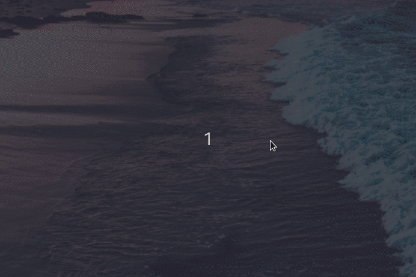

# ulauncher-lastpass

> Access your [LastPass](https://www.lastpass.com/) vault directly from Ulauncher

[](https://ext.ulauncher.io/)
[](https://github.com/brpaz/ulauncher-lastpass)
[](LICENSE)

## Demo



## Requirements

* [Ulauncher](https://github.com/Ulauncher/Ulauncher) > 5.0
* Python >= 3.4 with the packages:
  * [memoization](https://pypi.org/project/memoization/)
* [LastPass cli](https://github.com/lastpass/lastpass-cli)

## Install

Open ulauncher preferences window -> extensions -> add extension and paste the following url:

```
https://github.com/brpaz/ulauncher-lastpass
```

## Usage

You must login into your LastPass account using the cli tool, before being able to use the extension.

You can do so, by running `lpass login <username>`. You can use the `--trust` flag to save your credentials. Use it at your own risk.

* Type `lp` on ulauncher to trigger the extension. Keep typing until you found your site.
* You will be prompted to copy the username or password to the clipboard or the notes content if it´s a secure note.

## Development

```
git clone https://github.com/brpaz/ulauncher-lastpass
make link
```

The `make link` command will symlink the cloned repo into the appropriate location on the ulauncher extensions folder.

To see your changes, stop ulauncher and run it from the command line with: `make dev`.

## Contributing

All contributions are welcome. Just open an issue and/or create a PR.

If you like my work, feel free to "Buy me a Coffee"

<a href="https://www.buymeacoffee.com/Z1Bu6asGV" target="_blank"></a>

## License

MIT &copy; [Bruno Paz]
